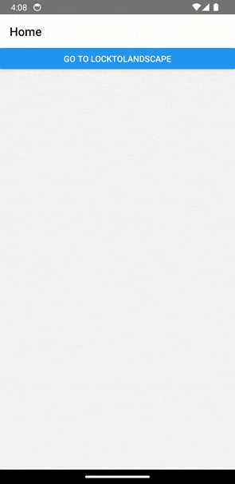

# react-native-direction-control


[](https://www.npmjs.com/package/react-native-direction-control)
[](https://www.npmjs.com/package/react-native-direction-control)
[](https://coveralls.io/github/calintamas/react-native-direction-control?branch=main)
[](https://github.com/prettier/prettier)

A flexible and feature-rich button component for React Native applications, offering a variety of customization options including icons, subtitles, loading state, and more.


`react-native-direction-control` is a React Native module for managing and controlling the device's screen direction. This module allows you to programmatically lock the device's screen to a specific direction and detect orientation changes.




## Features

- Retrieve the current screen direction.
- Lock the screen to a specific direction (landscape/portrait).
- Unlock screen direction to allow all orientations.
- Add and remove listeners for screen direction changes.

## Installation

```bash
npm install react-native-direction-control
# or
yarn add react-native-direction-control
```

## Usage

```javascript
import { DirectionControl } from 'react-native-direction-control';

// Get current screen direction
DirectionControl.getOrientation().then(direction => {
  console.log(direction);
});

// Lock to landscape direction
DirectionControl.lockToLandscape();

// Lock to portrait direction
DirectionControl.lockToPortrait();

// Unlock all orientations
DirectionControl.unlockAllDirections();

// Add a listener for direction changes
const onDirectionChange = direction => {
  console.log('Screen direction changed to:', direction);
};
DirectionControl.addDirectionChangeListener(onDirectionChange);

// Remove the listener
DirectionControl.removeDirectionChangeListener(onDirectionChange);
```

## API

### Methods

- `getOrientation()`: Promise<string>
- `lockToPortrait()`: void
- `lockToLandscape()`: void
- `unlockAllDirections()`: void
- `addDirectionChangeListener(callback: Function)`: void
- `removeDirectionChangeListener(callback: Function)`: void

## License

This project is licensed under the MIT License.
